# SaveGoals

    

    

    

    

## Descripción 📝
**SaveGoals** es una aplicación diseñada para ayudarte a cumplir tus metas financieras de una manera organizada y eficiente. Con SaveGoals, puedes establecer objetivos de ahorro personalizados, indicando el nombre del objetivo, la cantidad de dinero que deseas acumular y la fecha límite para alcanzarlo. La aplicación se encarga de mostrarte el progreso hacia tu meta, proporcionándote una visión clara de cuánto dinero has ahorrado hasta el momento y cuánto te falta por ahorrar.

### Características principales:
- **Creación de objetivos financieros:** Establece metas de ahorro personalizadas, incluyendo el nombre del objetivo, la cantidad deseada y la fecha límite.
- **Seguimiento del ahorro:** Añade fondos a tus objetivos, con la opción de incluir una descripción de la fuente de ingreso, permitiéndote ver el crecimiento de tu ahorro de manera detallada.
- **Visualización del progreso:** Observa de un vistazo cómo avanzas hacia tu meta a través de una representación gráfica en forma de rosca, que muestra el porcentaje de dinero ahorrado.
- **Planificación eficaz:** La aplicación calcula y te informa cuánto necesitas ahorrar diaria, semanal o mensualmente para cumplir con tu objetivo en el tiempo establecido.

## Instalación 🚀
Para instalar y ejecutar este proyecto en tu entorno de desarrollo, sigue estos pasos:

1. **Clonar el repositorio:** Primero, necesitas clonar el repositorio a tu máquina local. Abre una terminal o línea de comandos y ejecuta el siguiente comando: `git clone https://github.com/Aritz-Garcia/SaveGoals`. Esto descargará una copia del proyecto en tu equipo.

2. **Ejecutar el código:** Una vez clonado el repositorio, abre el proyecto descargado con Android Studio. Para hacerlo, inicia Android Studio, selecciona 'Open an existing Android Studio project', y navega hasta la ubicación donde clonaste el proyecto.
    
    Después de abrir el proyecto en Android Studio, espera a que el IDE complete la indexación y la construcción del gradle. Luego, puedes ejecutar el proyecto haciendo clic en el botón "▶" (Run) en la barra de herramientas de Android Studio.

Si encuentras algún problema al seguir estos pasos, asegúrate de tener instalada la última versión de Android Studio y el JDK adecuado para el proyecto.

## Galeria 🖼
### Modo claro: ☀

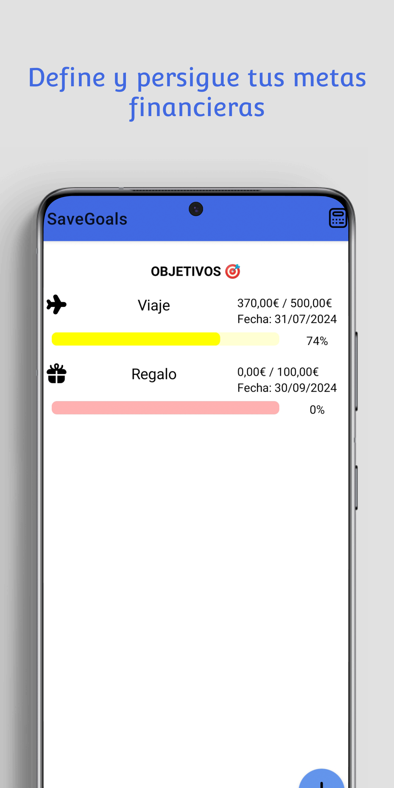
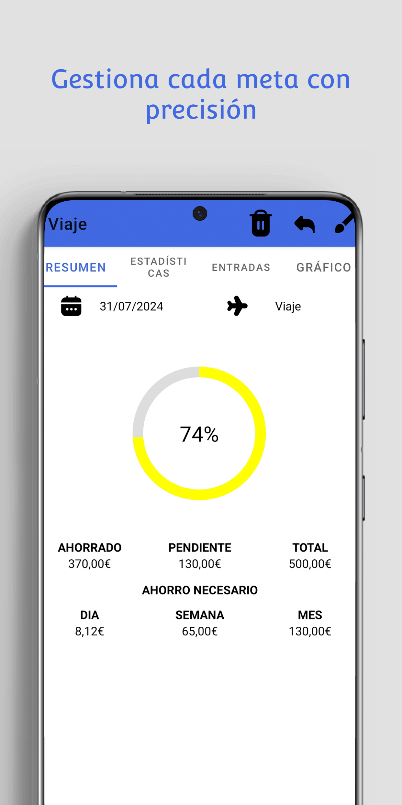
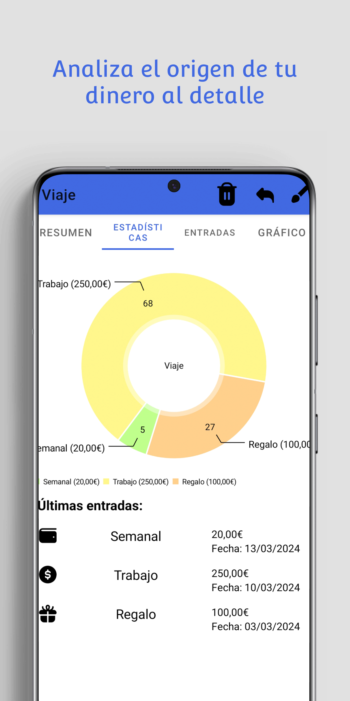
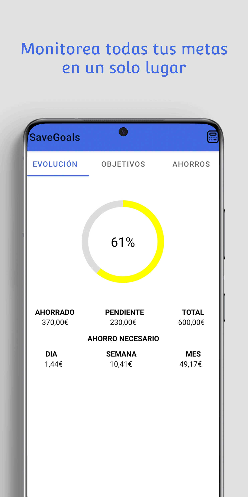
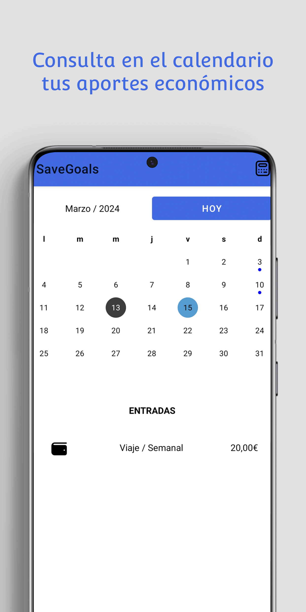
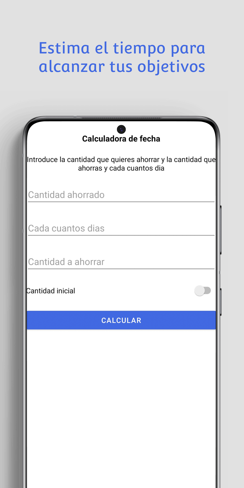

### Modo oscuro: 🌙

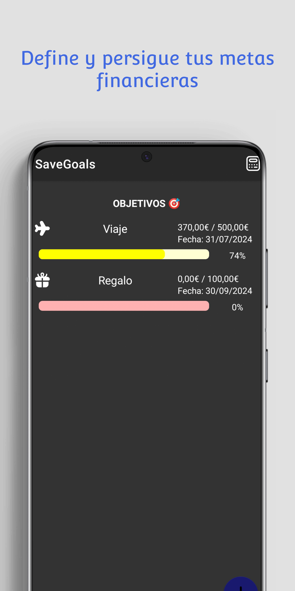
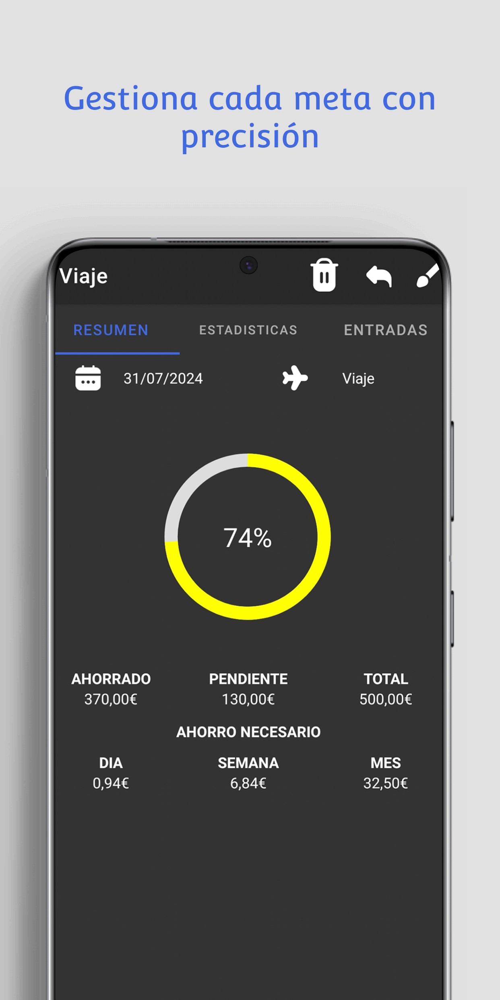
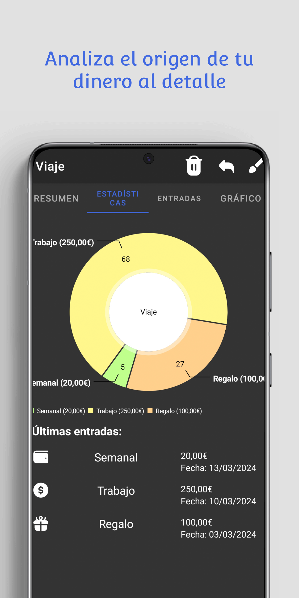
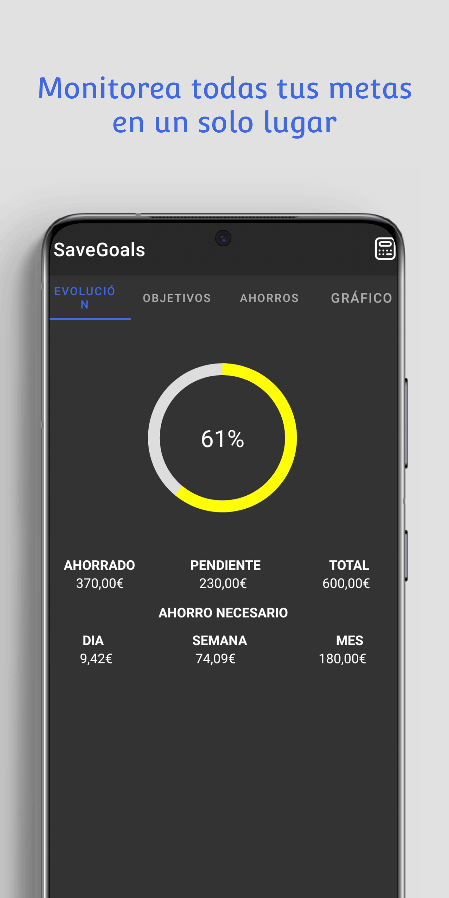
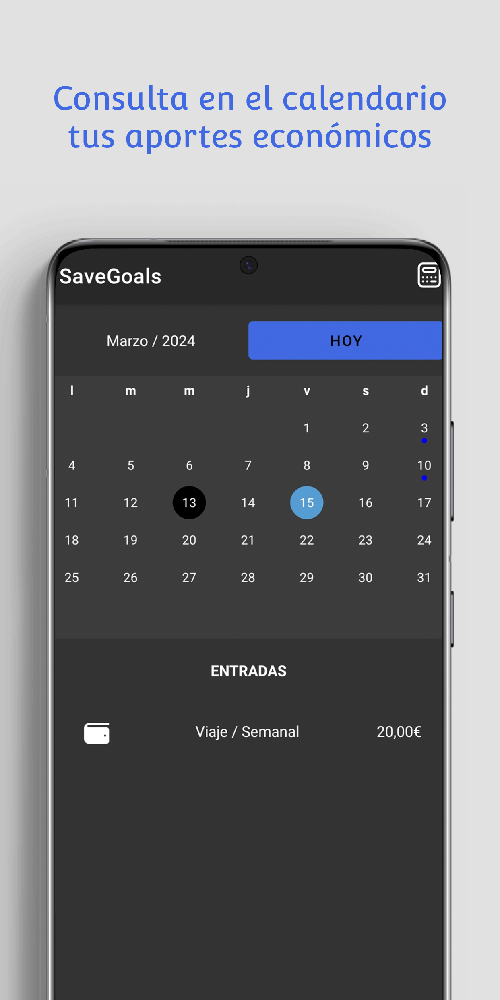
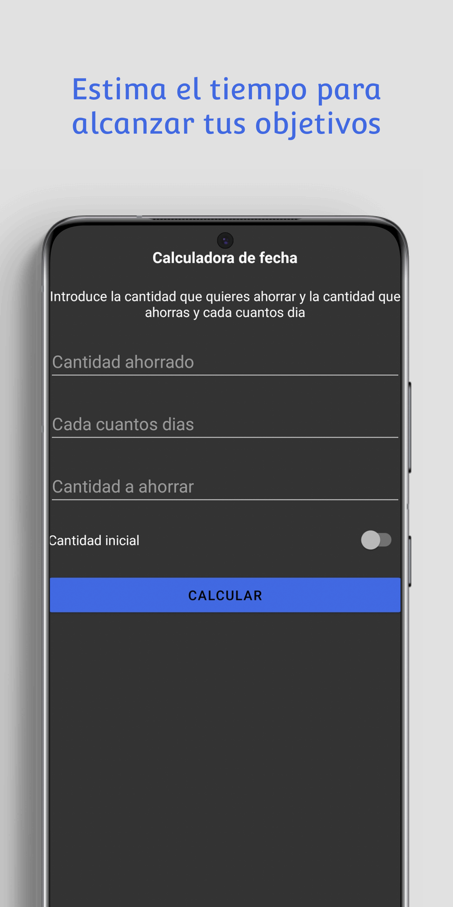

## Contribución 🧩
Lea [CONTRIBUTING.md](https://github.com/Aritz-Garcia/SaveGoals/tree/main/CONTRIBUTING.md) para obtener detalles sobre el código de conducta y el proceso para enviar solicitudes de extracción.

## Licencia 📄
Este proyecto incorpora múltiples licencias debido a la diversidad de componentes y su origen. A continuación, se detalla la información específica sobre las licencias y los componentes correspondientes:

- **Licencia MIT:** La mayoría de este proyecto está bajo la licencia MIT. Puedes ver el archivo [LICENSE.md](https://github.com/Aritz-Garcia/SaveGoals/tree/main/LICENSE.md) para más información. Bajo esta licencia tambien recae la parte del codigo correspondiente al calendario, el cual se ha adaptado del repositorio [CompactCalendarView](https://github.com/SundeepK/CompactCalendarView) de [SundeepK](https://github.com/SundeepK).
- **Licencia Apache 2.0:** Además de la licencia MIT hay parte del código que está bajo la licencia [Apache 2.0](https://github.com/PhilJay/MPAndroidChart/blob/master/LICENSE). Este componente en específico proviene del repositorio [MPAndroidChart](https://github.com/PhilJay/MPAndroidChart) de [PhilJay](https://github.com/PhilJay).

Para más información sobre cada licencia y las obligaciones que conlleva, por favor, consulte los archivos de licencia correspondientes y las referencias a los repositorios de origen.

## Donaciones 💰
Si quieres contribuir al proyecto puedes hacerlo de las siguientes maneras:

